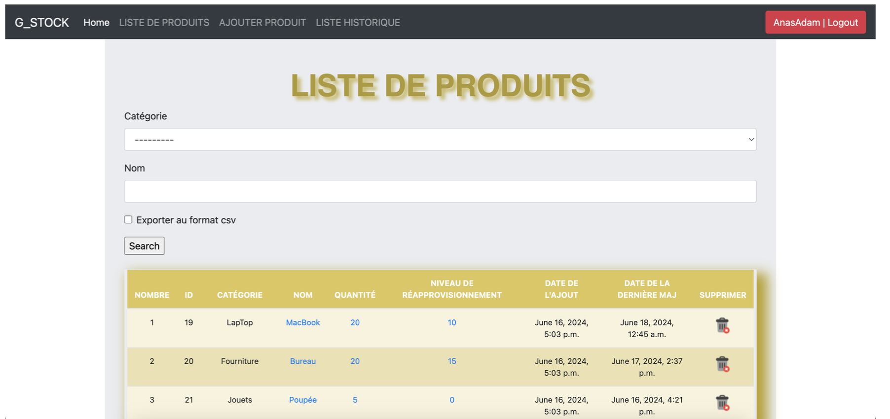
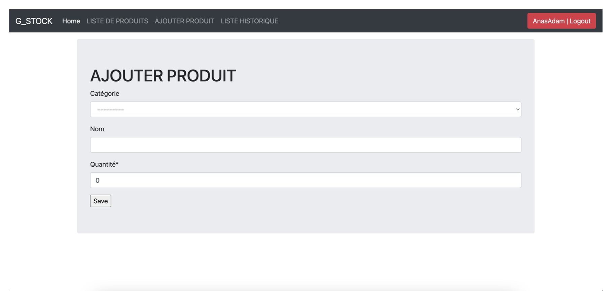
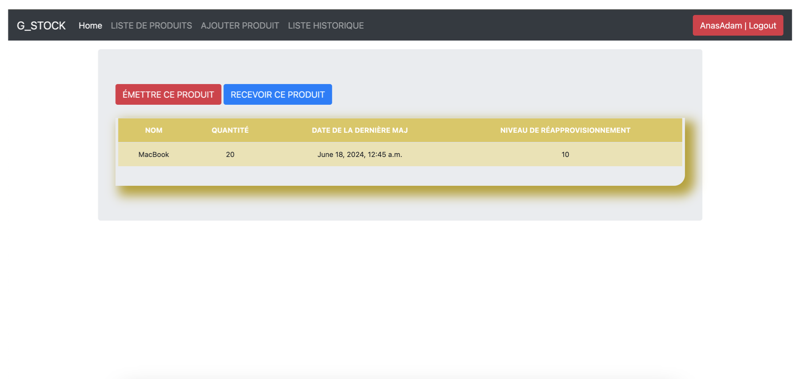
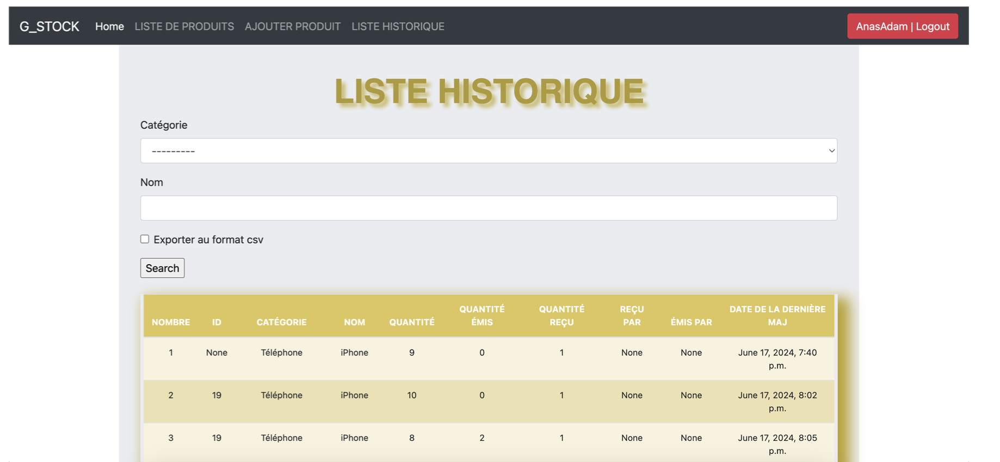

# GStock — Application web de gestion des stocks et des commandes (Django)


Application web **Django** pour gérer Produits, Commandes et Stocks, avec le rôle **Admin**, authentification sécurisée, interface Bootstrap 4 et base **SQLite** (par défaut).


---

## 📌 Sommaire

1. [Fonctionnalités](#-fonctionnalités)
2. [Stack technique](#-stack-technique)
3. [Architecture & modèles](#-architecture--modèles)
4. [Démarrage rapide](#-démarrage-rapide)
    - [Prérequis](#-prérequis)
    - [Configuration locale](#2-installation-&-configuration-locale)
    - [Lancer l’app en local](#3-lancer-lapp-en-local)
    - [Comptes de démonstration](#-comptes-de-démonstration)
5. [Gestion des données & administration](#-gestion-des-données-&-administration)
6. [Aperçu](#-aperçu-screenshots)
7. [Auteurs](#-auteurs)
8. [Licence](#-licence)

---

## ✅ Fonctionnalités

🔐 Authentification Django(login/logout) (**ADMIN)  
📦 **Produits** : CRUD + catégories + recherche  
👥 **Stocks** : CRUD complet  
🧾 **Commandes** : brouillon → validée → livrée 
📊 **Stocks** : décrémentation auto + vérification stock bas + historique
🖥️ UI responsive avec Bootstrap 4 (templates Django)

---

## 🛠️ Stack technique

| Technologie | Version |
|-------------|---------|
| Python | 3.10+ |
| Django | 2.2+ |
| SQLite | local |
| HTML | 5 |
| CSS | 3 |
| Bootstrap | 4 |

---

## 🏗️ Architecture & modèles

```
src/
├─ manage.py
├─ db.sqlite3
├─ .gitignore
├─ README.md
├─ PFA/                         # Projet Django (settings/urls/wsgi)
│  ├─ __init__.py
│  ├─ settings.py
│  ├─ urls.py
│  └─ wsgi.py
└─ G_STOCK/                     # Application métier (stocks & commandes)
   ├─ __init__.py
   ├─ admin.py
   ├─ apps.py
   ├─ forms.py
   ├─ models.py
   ├─ tests.py
   ├─ views.py
   ├─ migrations/
   ├─ static/                   # CSS/JS/Images (Bootstrap 4, etc.)
   └─ templates/                # Templates Django (HTML)

```

### Modèle de données (simplifié)

| Entité | Champs principaux                             |
|--------|-----------------------------------------------|
| Catégorie | id, nom              |
| Stock | id, categorie, nom, quantite, seuil_reappro, cree_le, maj    |
| Commande | id, date, client, statut , total              |
| StockHistory | id, categorie, nom, quantite, recu_par, emis_par, date_event |

---

## 🚀 Démarrage rapide

### 1️⃣ Prérequis

✅ Python **3.10+** <br/> 
✅ pip et virtualenv (optionnel) <br/>
✅ MySQL 8 local ou Docker  <br/>
✅ Git<br/>
✅ SQLite est inclus avec Python → rien à installer <br/>


### 2️⃣ Installation & configuration locale

Depuis le dossier contenant `manage.py` :

```
# 1) Créer et activer l'environnement virtuel (recommandé)

python3 -m venv venv
source venv/bin/activate   # macOS/Linux
# .\venv\Scripts\activate  # Windows PowerShell

# 2) Installer les dépendances

pip install --upgrade pip
pip install django==2.2 bootstrap4 django-crispy-forms

# 3) Créer le fichier de configuration local (optionnel)

#   settings.py peut lire des variables d'env si tu ajoutes python-dotenv
#   Pour un démarrage rapide avec SQLite, rien n'est requis.


```

Paramètres SQLite par défaut dans `G_STOCK/settings.py` :

```

DATABASES = {
    'default': {
        'ENGINE': 'django.db.backends.sqlite3',
        'NAME': os.path.join(BASE_DIR, 'db.sqlite3'),
    }
}

```

### 3️⃣ Lancer l’app en local

```

# Appliquer les migrations

python manage.py makemigrations
python manage.py migrate

# Créer un superuser

python manage.py createsuperuser

# Lancer le serveur

python manage.py runserver

```


#### ➡️ App dispo sur : http://127.0.0.1:8000/


### 🔑 Comptes de démonstration

| Rôle | Username | Mot de passe |
|------|----------|---------|
| Admin | AnasAdam | kriryouri1 |


--- 

 ## 🗃 Gestion des données & administration 

#### ➡️ Administration : via /admin (gestion rapide des produits, clients, commandes).

#### ➡️ Import/Export (optionnel) : tu peux ajouter django-import-export pour CSV/Excel.

---

## 🎥 Aperçu (screenshots)

| Produits | Add Produit         | Livrer ou recevoir produit | Historique des transactions               |
|-------|-------------------------|----------|-------------------------|
|  |  |  |  |

---

## 👥 Auteurs

- **Anas KRIR** — Développeur Back-End / Gestion du projet
- **Adam EL YOURI** — Développeur Front-End / UI & intégration

---

 ## 📄 Licence

Projet sous licence MIT. <br/>
✅ Libre d’utiliser, modifier, distribuer.

© 2024 — KRIR Anas & EL YOURI Adam

---


